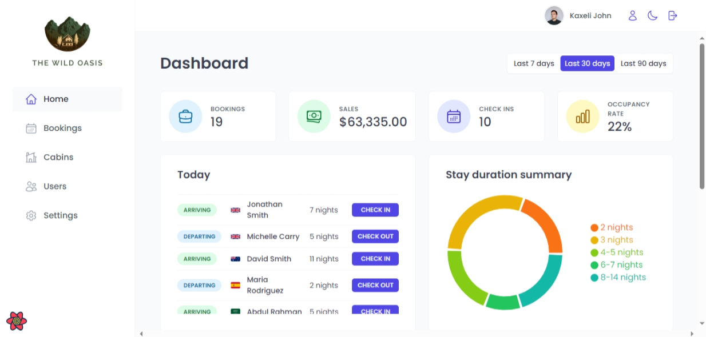

# The Wild Oasis

The Wild Oasis project is a **custom-built internal application** designed for a small boutique hotel with 8 luxurious wooden cabins. The application manages hotel operations, including **bookings, cabins, and guest check-ins as they arrive**. It relies on an **API** to handle data, which will also support future plans for a **customer-facing website** where guests can book their stays.

---

## Features

- **Hotel Operations Management**: Manage bookings, cabin availability, and guest check-ins.
- **Internal Application**: Designed for hotel staff to streamline operations.
- **Interactive UI**: User-friendly and responsive interface for seamless navigation.
- **Component-based Architecture**: Reusable components for efficient development.
- **Light Mode and Dark Mode**: This project supports both light and dark modes for a better user experience across different environments. You can toggle between them based on your preference.
- **API-Driven**: Centralized API to handle hotel data.
- **Future Expandability**: The same API will be used to build a customer-facing website for booking stays.

---

## Live Demo And Login Details

Live Demo: https://the-wild-oasis-by-an.vercel.app/

To explore the app, use the following credentials:

- **Email**: `kaxeli8766@bawsny.com`
- **Password**: `11111111`

These details allow you to log in and experience the application's full functionality.

---

## Screenshots



## Getting Started

Follow these steps to run the project locally:

### Prerequisites

- Node.js (v14 or higher)
- npm or yarn

### Installation

1. Clone the repository:

   ```bash
   git clone https://github.com/your-username/The-Wild-Oasis-by-AN.git
   cd The-Wild-Oasis-by-AN
   ```

2. Install dependencies:

```bash
npm install
```

3. Start the development server:

```bash
npm run dev
```

4. Open the app in your browser at the provided local development server.

## Project Structure

the-wild-oasis/  
├── node_modules/ # Dependencies installed via npm  
├── public/ # Static files (e.g., favicon, images)  
├── src/ # Source code directory  
│ ├── context/ # React Context API files for state management  
│ ├── data/ # Static or mock data files  
│ ├── features/ # Application features, organized by functionality  
│ ├── hooks/ # Custom React hooks  
│ ├── pages/ # Page-level components for routing  
│ ├── services/ # API calls and service logic  
│ ├── styles/ # Global and component-specific styles  
│ ├── ui/ # Reusable UI components (e.g., buttons, inputs)  
│ ├── utils/ # Utility functions/helpers  
│ ├── App.jsx # Root component of the app  
│ ├── main.jsx # React entry point file  
│ └── .env # Environment variables  
├── .eslintrc.json # ESLint configuration  
├── .gitignore # Specifies files to ignore in version control  
├── index.html # Root HTML file  
├── package.json # Project configuration and dependencies  
├── package-lock.json # Lockfile for npm dependencies  
└── vite.config.js # Vite configuration file
