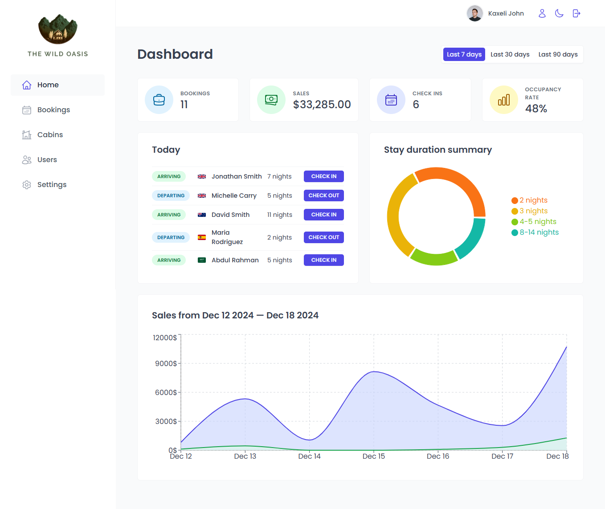

# The Wild Oasis

The Wild Oasis project is a **custom-built internal application** designed for a small boutique hotel with 8 luxurious wooden cabins. The application manages hotel operations, includingernal application\*\* designed for a small boutique hotel wi It relies on an README.mto handle data, which will also support future plans for a Wild Oasis

The Wild Oasiswhere guests can book their stays.

---

## Features

-Wild Oasis

The Wild Oasis proj Manage bookings, cabin availability, and guest check-ins.  
-d Oasis

The Wild Oasis Designed for hotel staff to streamline operations.  
-The Wild Oasis Centralized API to handle hotel data.  
-n format:

# The Wild Oasi The same API will be used to build a customer-facing website for booking stays.

-sis project is a \*\*c User-friendly and responsive interface for seamless navigation.  
-s

The Wild Oasis project is a \* Reusable components for efficient development.

---

## Demo Login Details

To explore the app, use the following credentials:

-\*\* designedHere is the full README.m

- Password: 11111111

These details allow you to log in and experience the application's full functionality.

---

## Getting Started

Follow these steps to run the project locally:

### Prerequisites

- Node.js (v14 or higher)
- npm or yarn

### Installation

1. Clone the repository:

   ```bash
   git clone https://github.com/your-username/the-wild-oasis.git
   cd the-wild-oasis

   ```

2. Install dependencies:

npm install

3.  Start the development server:

npm run dev

4.  Open the app in your browser at http://localhost:3000.

Project Structure

the-wild-oasis/  
├── node_modules/ # Dependencies installed via npm  
├── public/ # Static files (e.g., favicon, images)  
├── src/ # Source code directory  
│ ├── context/ # React Context API files for state management  
│ ├── data/ # Static or mock data files  
│ ├── features/ # Application features, organized by functionality  
│ ├── hooks/ # Custom React hooks  
│ ├── pages/ # Page-level components for routing  
│ ├── services/ # API calls and service logic  
│ ├── styles/ # Global and component-specific styles  
│ ├── ui/ # Reusable UI components (e.g., buttons, inputs)  
│ ├── utils/ # Utility functions/helpers  
│ ├── App.jsx # Root component of the app  
│ ├── main.jsx # React entry point file  
│ └── .env # Environment variables  
├── .eslintrc.json # ESLint configuration  
├── .gitignore # Specifies files to ignore in version control  
├── index.html # Root HTML file  
├── package.json # Project configuration and dependencies  
├── package-lock.json # Lockfile for npm dependencies  
└── vite.config.js # Vite configuration file

Screenshots



Deployment

If deployed, add deployment details here:
• Live Demo: The Wild Oasis (https://your-live-demo-url.com/)

License

This project is licensed under the MIT License. See the LICENSE file for details.
